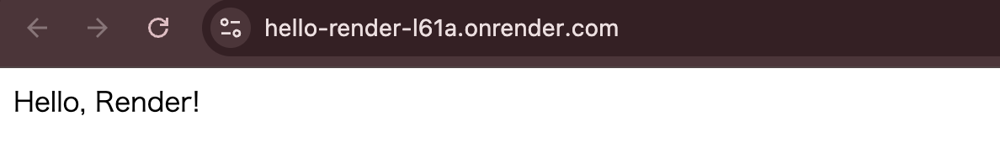
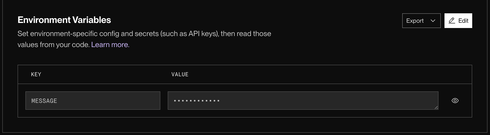
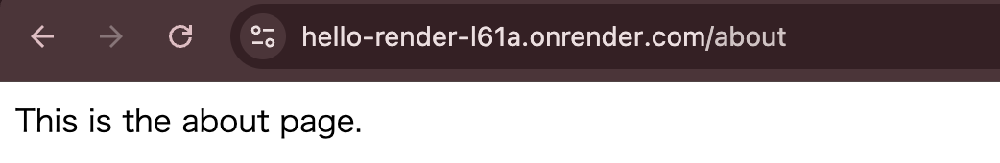
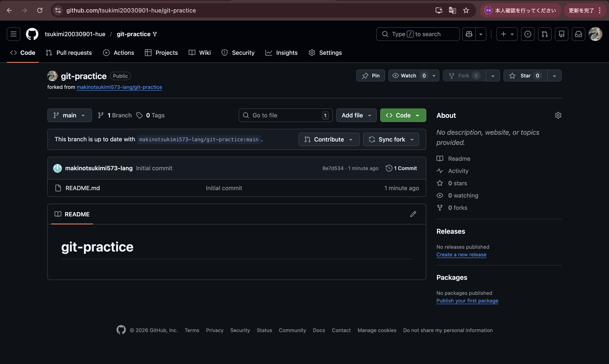
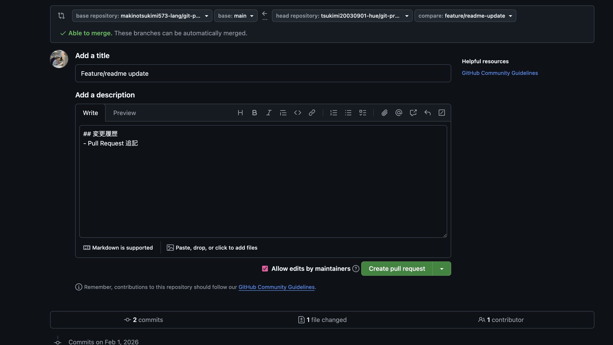

# テーマ9 Renderによる公開とチーム開発

## 92 サンプルNode.jsアプリをRenderで公開

#### jsコード
```js
const express = require("express");
const app = express();

// RenderではPORT指定が必須
const PORT = process.env.PORT || 3000;

app.get("/", (req, res) => {
  res.send("Hello, Render!");
});

app.listen(PORT, () => {
  console.log(`Server running on port ${PORT}`);
})
```

#### 実行画面



## 94 環境変数（Environment Variables）を設定せよ

#### 設定画面


#### jsコード
```js
const express = require("express");
const app = express();

const PORT = process.env.PORT || 3000;

// ★ 環境変数を取得
const message = process.env.MESSAGE;

app.get("/", (req, res) => {
  res.send(`環境変数の値：${message}`);
});

app.listen(PORT, () => {
  console.log(`Server running on port ${PORT}`);
});
```


## 95 ルート以外のエンドポイントの公開

#### index.js
```js
const express = require("express");
const app = express();

const PORT = process.env.PORT || 3000;

// ルート
app.get("/", (req, res) => {
  res.send("Hello, Render!");
});

// /api/hello
app.get("/api/hello", (req, res) => {
  res.json({ message: "Hello from API!" });
});

// /about
app.get("/about", (req, res) => {
  res.send("This is the about page.");
});

app.listen(PORT, () => {
  console.log(`Server running on port ${PORT}`);
});
```

#### 実行画面



## 96 チーム開発用にリポジトリをfork・clone

#### fork後の画面


## 97 Pull Requestを利用した開発

#### branch作成
```
git branch

  develop
* feature/readme-update
  main
```

#### pull request
