# テーマ3 フロントエンドJavaScript入門

## 30 JavaScriptファイルの読み込み
### ブラウザのコンソール出力のスクリーンショット
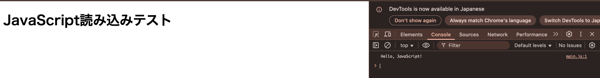
### JavaScript
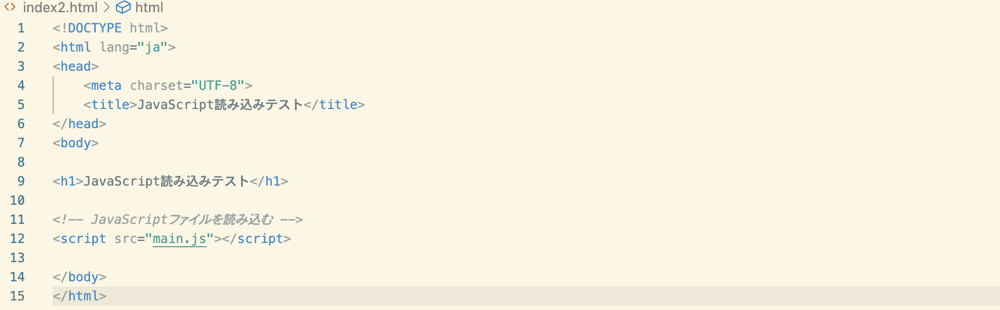
### HTML
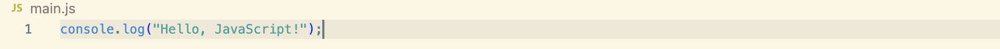

## 31 変数・配列・オブジェクトの基本
### ブラウザ
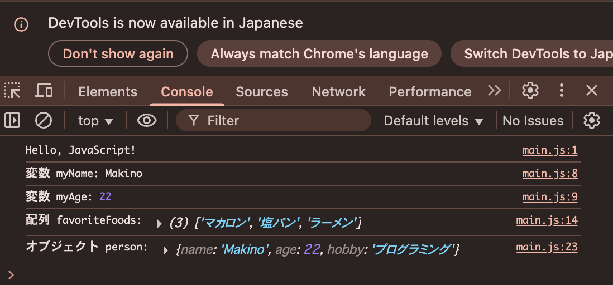
### JavaScript
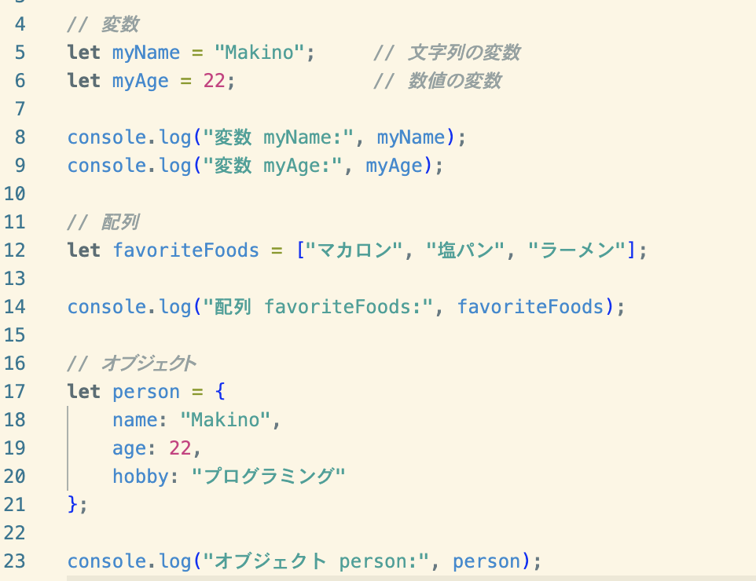

## 32 基本的な演算と条件分岐
### ブラウザ
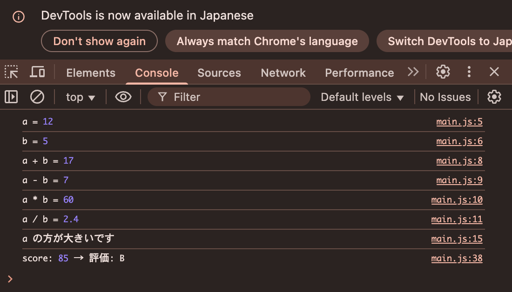
### JavaScript

## 33 繰り返し処理
### ブラウザ
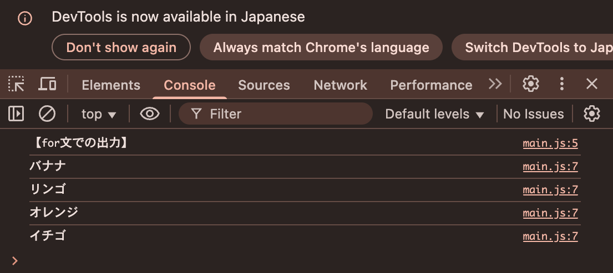
### JavaScript
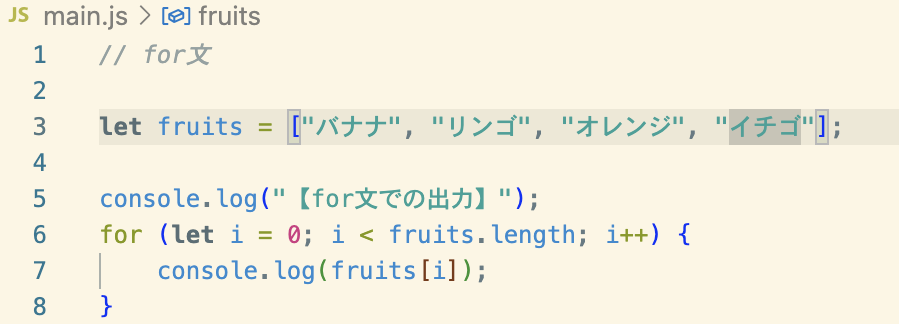

## 34 関数の定義
### ブラウザ
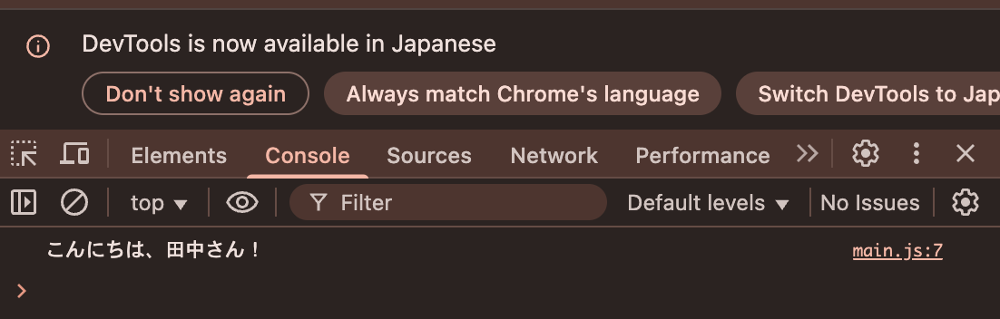
### JavaScript
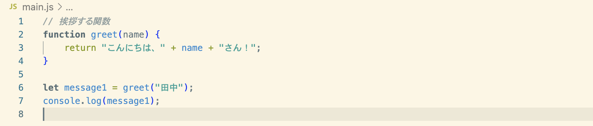

## 35 マウスイベント処理
### ブラウザ
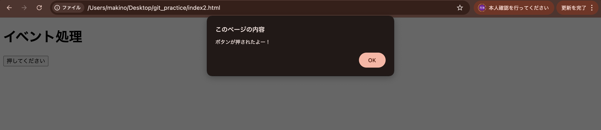
### JavaScript
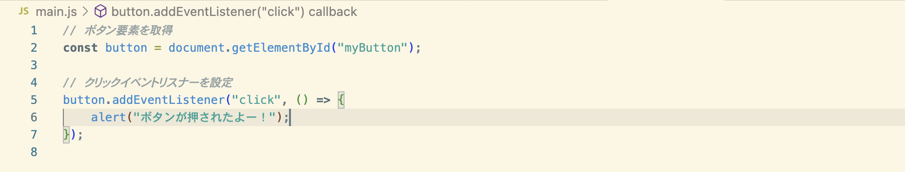
### HTML
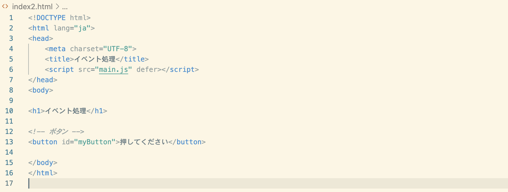

## 36 入力の取得
### ブラウザ
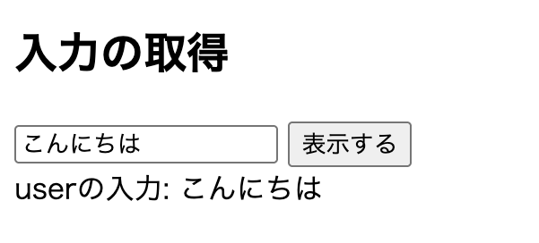
### JavaScript
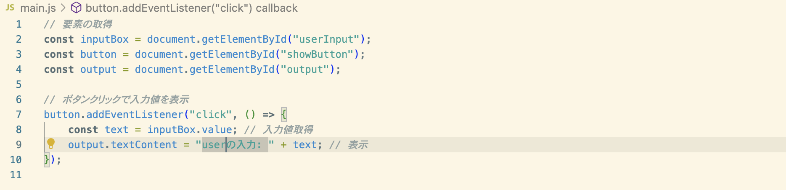
### HTML
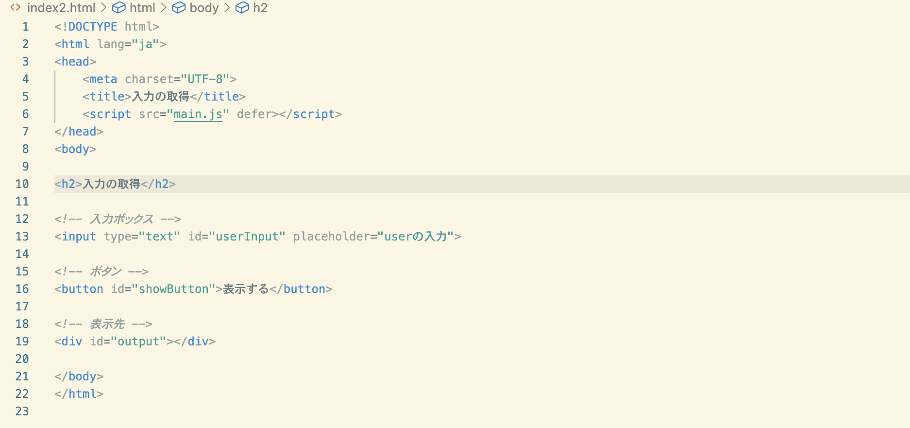

## 37 DOM操作
### ブラウザ　変更前の表示

### ブラウザ　変更後の表示
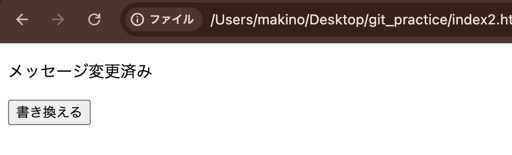

### JavaScript
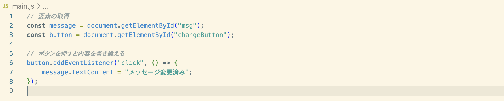

### HTML
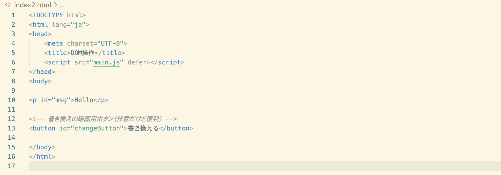

## 38 動的なリスト表示
### ブラウザ
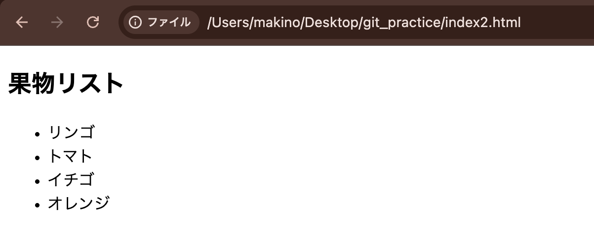
### JavaScript
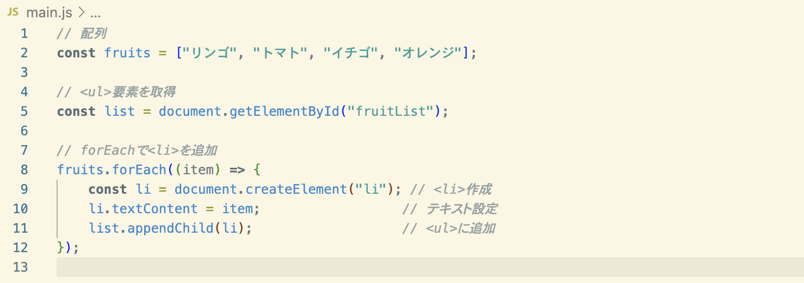
### HTML
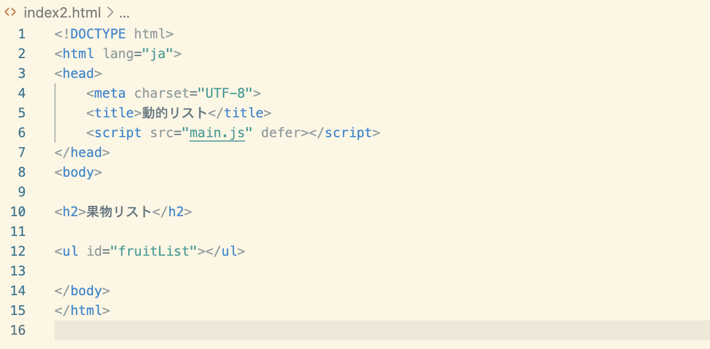

## 39 入力フォームの利用
### ブラウザ　入力前の画面
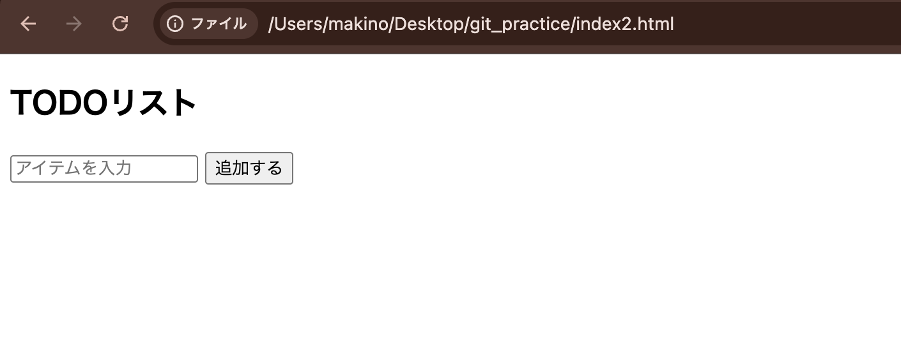
### ブラウザ　入力
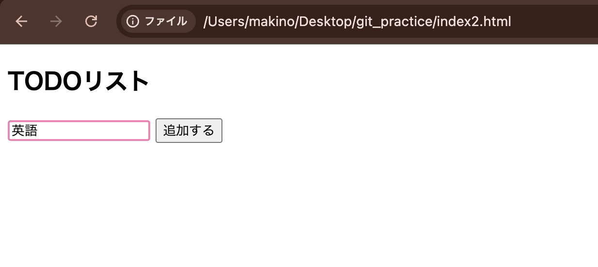
### ブラウザ　入力後の画面
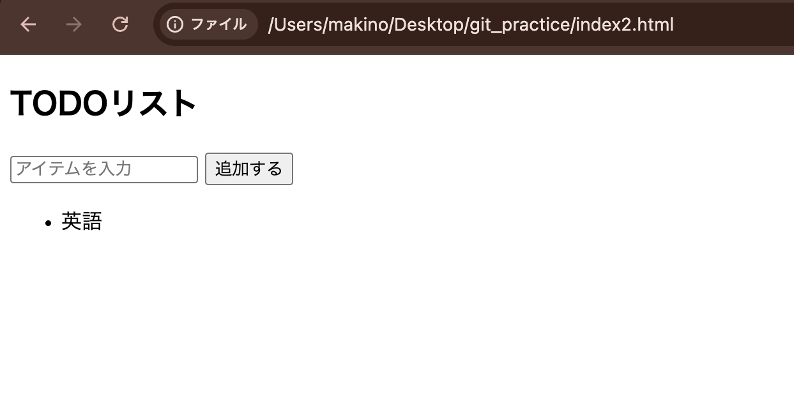

### JavaScript
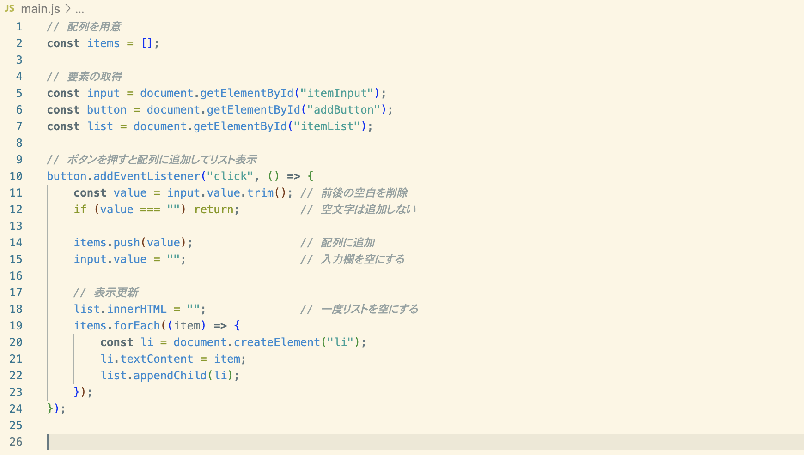

### HTML
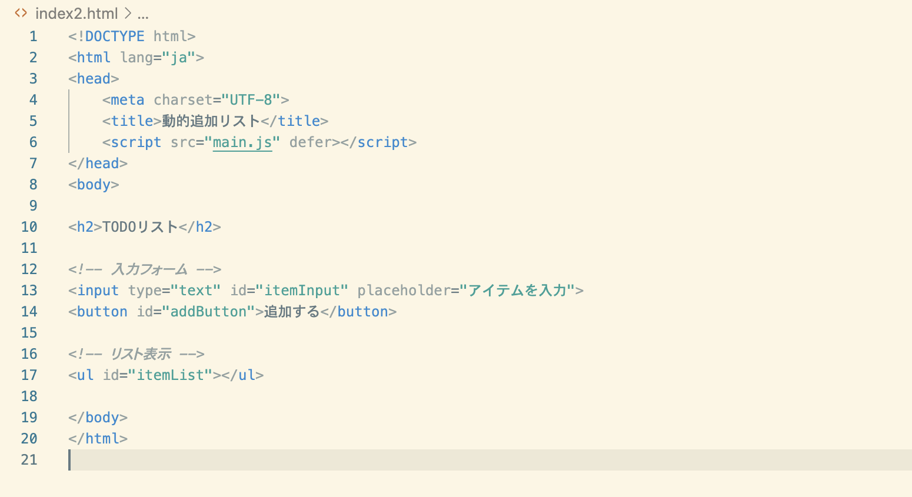
