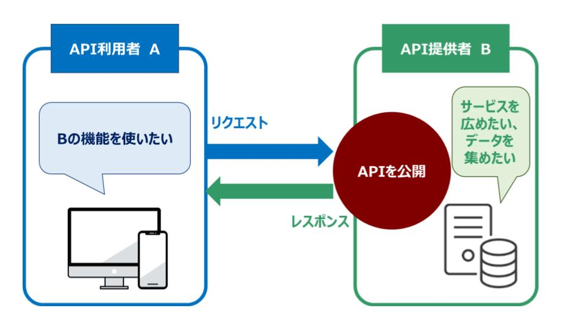

# 5章

## 40 APIとは何か

### APIとは
　　　異なるソフトウェア同士が機能やデータをやり取りするための「接点」や「窓口」となる仕組み
### REST APIの特徴
　　- HTTPを利用して通信するAPI方式である
　　- Webブラウザが使う操作（GET, POST, PUT, DELETEなど）をそのまま利用
　　- リソース（情報の対象）をURLで表現する
　　　　　例: /users/1 は「ID=1のユーザー」というリソース
　　- ステートレス（サーバーが利用者の状態を持たない）
　　- そのため処理がシンプルで拡張しやすい
　　- 統一されたルールで設計されるため、理解しやすく他のサービスと連携しやすい
### REST APIの仕組み
　　①クライアント（アプリ・ブラウザ）がHTTPリクエストを送る
　　　　　　例: GET /users/1（ユーザー情報を取得）
　　②サーバー側がリソースを処理し、JSON などでレスポンスを返す
　　　　　　JSON は軽量で扱いやすく、RESTで最も一般的
　　③クライアントは返ってきたデータを画面表示や処理に使用する
　　　　　　例: ユーザー情報の表示・編集・削除など
### REST APIの使用例
　　- SNSアプリの投稿取得
　　- 地図アプリの位置情報取得

## 41 シンプルなHTTPサーバ

### ソースコード
