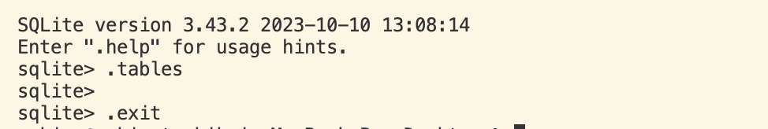
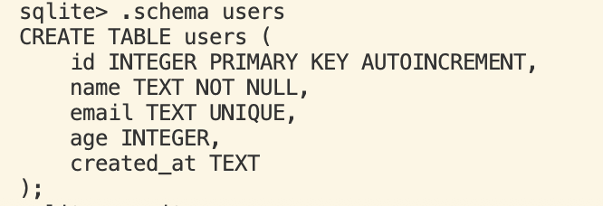
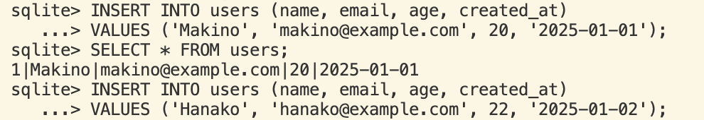
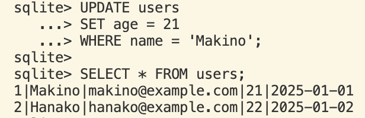
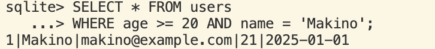
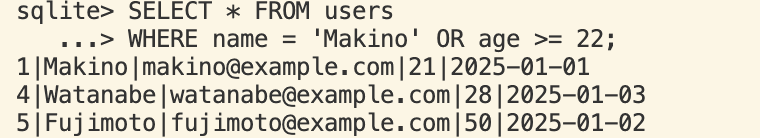
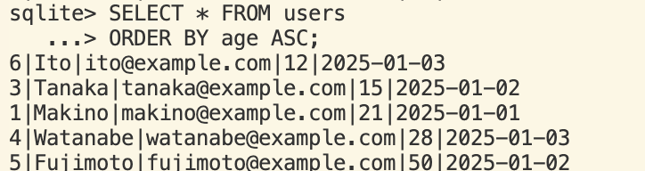
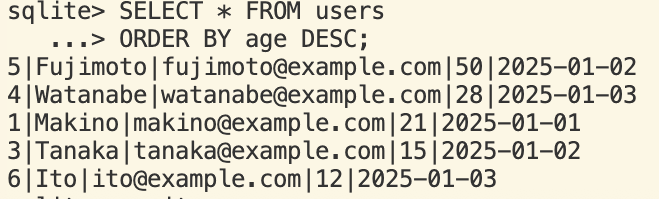

# 5章

## 51 SQLiteを用いたデータベースの作成

## 52 SQLでテーブルを作成

## 53 レコードの追加・検索

## 54 レコードの更新・削除

## 55 複数条件での検索や並べ替え

  ### 検索

  (ex)年齢が20以上 かつ 名前が Makino のユーザを検索
  

  (ex)年齢が20以上 または 名前が Makino のユーザを検索
  

  
  ### 並び替え

  (ex)年齢の昇順で並べ替え
  

  (ex)年齢の降順で並び替え
  
