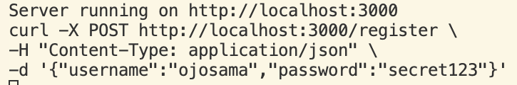
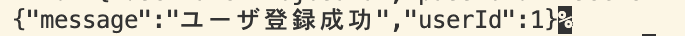
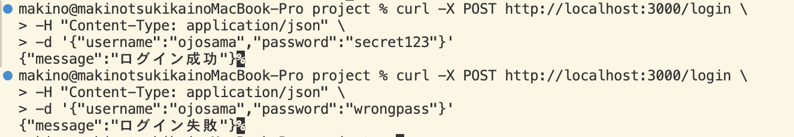
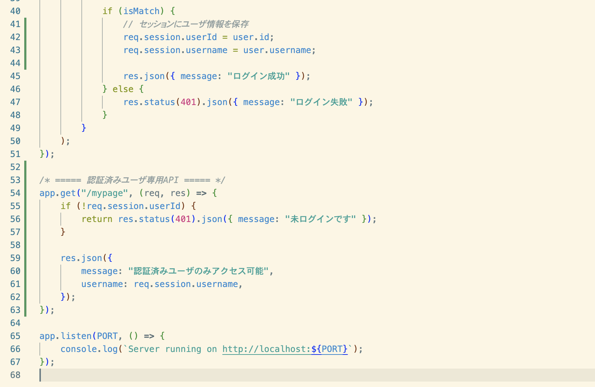
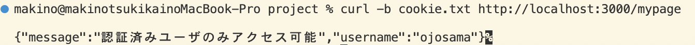
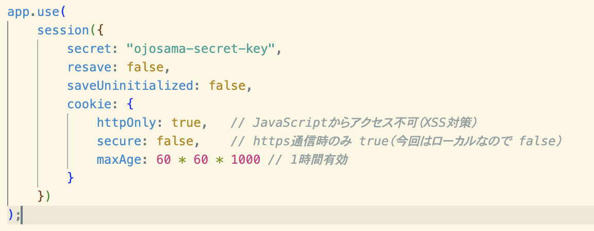
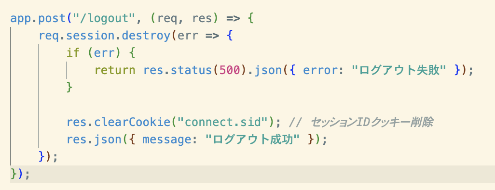
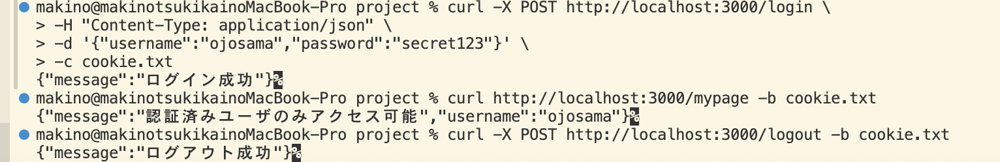

# テーマ6 ユーザ認証とセッション管理

## 60 認証と認可の違い
認証（Authentication）とは、ユーザが「誰であるか」を確認する仕組みであり、IDやパスワード、指紋認証などによって本人確認を行う。一方、認可（Authorization）とは、認証されたユーザに対して「何をしてよいか」という権限を制御する仕組みである。Webサービスでは、まず認証によってユーザを特定し、その後、管理者や一般ユーザなどの権限に応じて利用可能な機能や情報へのアクセスを認可によって制御する。

## 61 セッションとクッキーの仕組み
クッキー（Cookie）とは、Webブラウザに保存される小さなデータであり、ユーザIDや設定情報などを保持するために利用される。一方、セッション（Session）とは、サーバ側でユーザごとの状態を管理する仕組みである。Webサービスでは、ログイン時にクッキーに保存されたセッションIDを用いてサーバがユーザを識別し、セッション情報を参照する。クッキーは端末側に保存されるため改ざんのリスクがあり、重要な情報はセッションとしてサーバ側で管理することが一般的である。

## 62 パスワードの安全な保存
パスワードを平文（生パスワード）のまま保存すると、データベースが漏洩した際に利用者のパスワードがそのまま第三者に知られてしまい、なりすましや二次被害につながる危険がある。そのため、Webサービスではパスワードをハッシュ化して保存することが重要である。bcryptやscrypt、pbkdf2などの手法は、計算に時間がかかる設計となっており、総当たり攻撃やレインボーテーブル攻撃を防ぐ効果がある。これにより、万が一情報が漏洩しても被害を最小限に抑えることができる。

## 63 ユーザ登録API

### サーバサイドコード

### 実行結果

## 64 ログインAPI
### サーバサイドコード

## 65 セッション管理
### サーバーサイドコード

## 66 クッキーを利用したセッション管理
### サーバサイドコード

## 67 ログアウト処理

### サーバサイドコード（ログアウト部分抜粋）

### 動作確認
