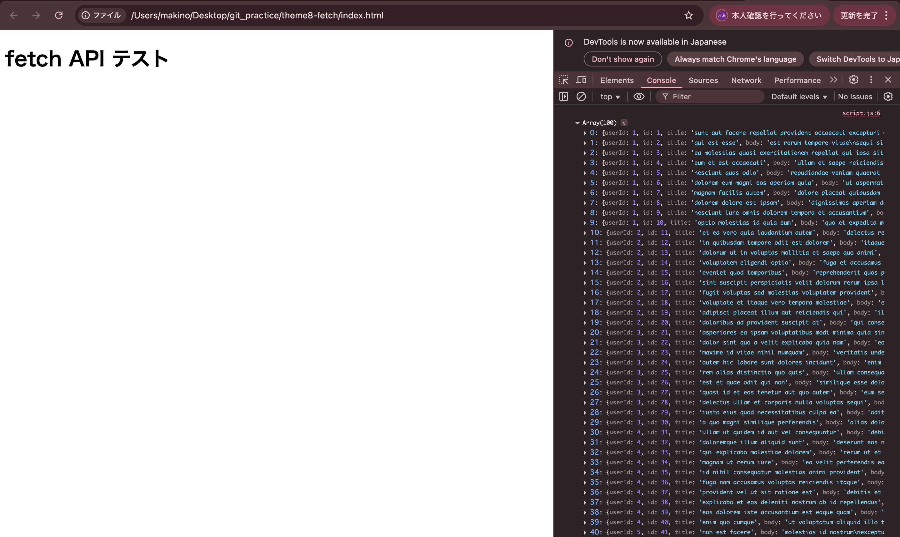
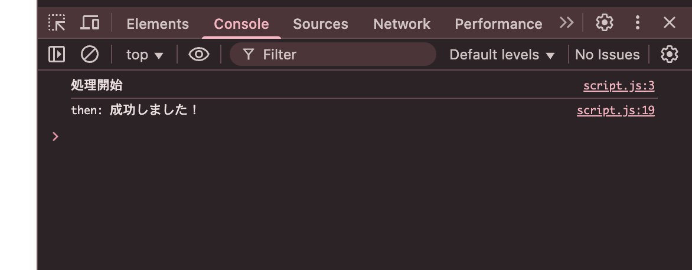
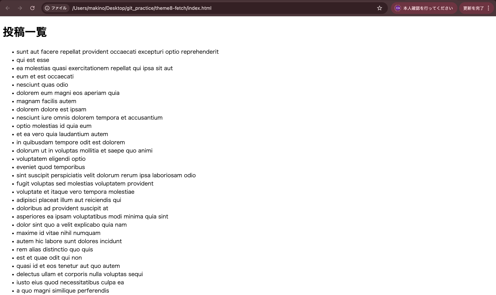
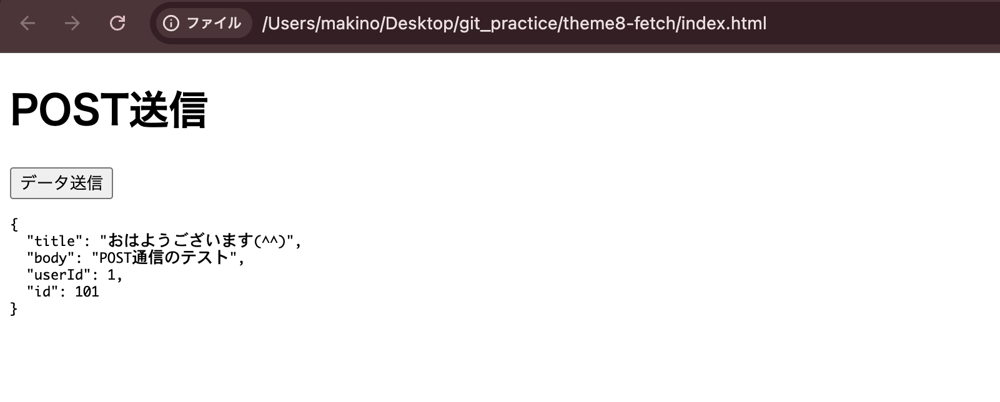

# テーマ8 React（JSフレームワーク）入門非同期通信とフロントエンド連携

## 80 fetchを用いたAPIからのデータ取得

#### jsコード

'''js
fetch("https://jsonplaceholder.typicode.com/posts")
  .then(response => {
    return response.json(); // JSON形式に変換
  })
  .then(data => {
    console.log(data); // 取得したデータを表示
  })
  .catch(error => {
    console.error("エラーが発生しました", error);
  });
'''

#### HTMLコード

'''HTML
<!DOCTYPE html>
<html lang="ja">
<head>
  <meta charset="UTF-8">
  <title>fetch練習</title>
</head>
<body>
  <h1>fetch API テスト</h1>

  <!-- JavaScriptを読み込む -->
  
</body>
</html>
'''

#### 実行画面

## 81 非同期通信（Promise）の基本

#### jsコード

'''js
// Promiseを作成
const myPromise = new Promise((resolve, reject) => {
  console.log("処理開始");

  setTimeout(() => {
    const success = true; // falseにすると失敗パターン

    if (success) {
      resolve("成功しました！");
    } else {
      reject("失敗しました…");
    }
  }, 2000);
});

// Promiseの結果を受け取る
myPromise
  .then(result => {
    console.log("then:", result);
  })
  .catch(error => {
    console.error("catch:", error);
  });
'''

#### 実行結果

## 82 APIデータの表示せよ（バニラJS）

#### HTMlコード

'''HTML
<!DOCTYPE html>
<html lang="ja">
<head>
  <meta charset="UTF-8">
  <title>APIデータ表示</title>
</head>
<body>
  <h1>投稿一覧</h1>

  <!-- ここにAPIデータを表示 -->
  <ul id="post-list"></ul>

  
</body>
</html>
'''

#### jsコード

'''js
fetch("https://jsonplaceholder.typicode.com/posts")
  .then(response => {
    return response.json();
  })
  .then(data => {
    const postList = document.getElementById("post-list");

    data.forEach(post => {
      const li = document.createElement("li");
      li.textContent = post.title;
      postList.appendChild(li);
    });
  })
  .catch(error => {
    console.error("エラーが発生しました", error);
  });
'''

#### 実行画面

## 83 API取得中・完了後の状態表示

#### HTMLコード

'''HTML
<!DOCTYPE html>
<html lang="ja">
<head>
  <meta charset="UTF-8">
  <title>API Loading 表示</title>
</head>
<body>
  <h1>投稿一覧</h1>

  <!-- ローディング表示 -->
  
Loading...

  <!-- データ表示 -->
  <ul id="post-list"></ul>

  
</body>
</html>
'''

#### jsコード

'''js
const loading = document.getElementById("loading");
const postList = document.getElementById("post-list");

fetch("https://jsonplaceholder.typicode.com/posts")
  .then(response => response.json())
  .then(data => {
    // Loadingを消す
    loading.style.display = "none";

    data.forEach(post => {
      const li = document.createElement("li");
      li.textContent = post.title;
      postList.appendChild(li);
    });
  })
  .catch(error => {
    loading.textContent = "エラーが発生しました";
    console.error(error);
  });
'''

## 84　エラー処理
#### HTMLコード

'''HTML
<!DOCTYPE html>
<html lang="ja">
<head>
  <meta charset="UTF-8">
  <title>API エラー処理</title>
</head>
<body>
  <h1>投稿一覧</h1>

  
Loading...

  

  <ul id="post-list"></ul>

  
</body>
</html>
'''

#### jsコード

'''js
const loading = document.getElementById("loading");
const errorMsg = document.getElementById("error");
const postList = document.getElementById("post-list");

// ❌ わざとURLを間違える
fetch("https://jsonplaceholder.typicode.com/postssss")
  .then(response => {
    if (!response.ok) {
      throw new Error("通信に失敗しました");
    }
    return response.json();
  })
  .then(data => {
    loading.style.display = "none";

    data.forEach(post => {
      const li = document.createElement("li");
      li.textContent = post.title;
      postList.appendChild(li);
    });
  })
  .catch(error => {
    loading.style.display = "none";
    errorMsg.textContent = "データの取得に失敗しました";
    console.error(error);
  });
'''

#### 実行画面

## 85 POSTメソッドでのAPIデータ送信

#### HTMLコード

'''HTML
<!DOCTYPE html>
<html lang="ja">
<head>
  <meta charset="UTF-8">
  <title>POST送信テスト</title>
</head>
<body>
  <h1>POST送信</h1>

  <button id="sendBtn">データ送信</button>

  <pre id="result"></pre>

  
</body>
</html>
'''

#### jsコード

'''js
const button = document.getElementById("sendBtn");
const result = document.getElementById("result");

button.addEventListener("click", () => {
  fetch("https://jsonplaceholder.typicode.com/posts", {
    method: "POST", 
    headers: {
      "Content-Type": "application/json"
    },
    body: JSON.stringify({
      title: "おはようございます(^^)",
      body: "POST通信のテスト",
      userId: 1
    })
  })
    .then(response => response.json())
    .then(data => {
      console.log(data); // コンソール確認用
      result.textContent = JSON.stringify(data, null, 2);
    })
    .catch(error => {
      console.error("エラー:", error);
    });
});
'''

#### 実行画面

## 86 ReactでのAPIからのデータ取得